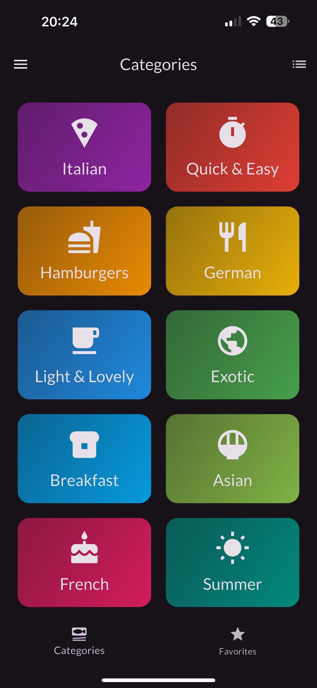

# Meals App
## Introduction
This project is a part of the IDATA2503 course at NTNU Ålesund. The app allows a user to browse a variety of meals from different cuisines, add them to their favourites and put all the needed ingredients into a personalized shopping cart. At the current state it does not offer permanent storage, but could be implemented in the future.

## Class Diagram

## Screenshots

    
    
    

